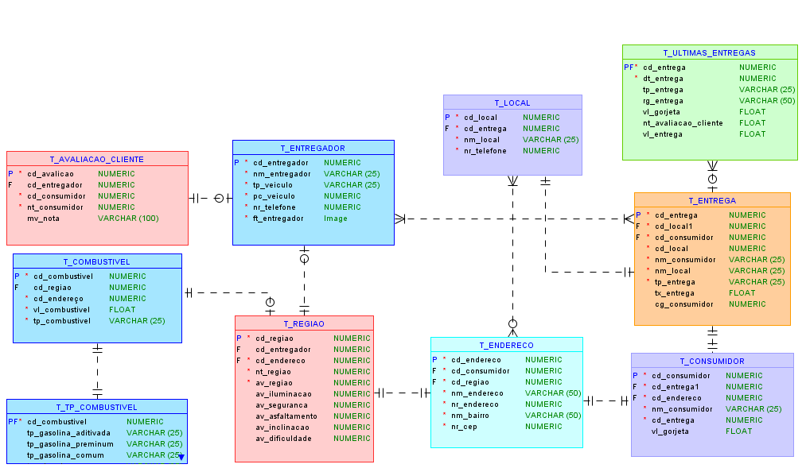

# Challenge ifood

Challenge desenvolvido no tecnólogo de Análise e Desenvolvimento de Sistemas onde o desafio era criar um modelo lógico de dados para o novo Dashboard dos entregadores do Ifood, onde será possível visualizar as últimas entregas, podendo filtrar por região, tipo de entrega (Alimentação, Mercado, Farmácia ou outros) entre outros critérios.

### **Resultado final do modelo lógico desenvolvido:**

